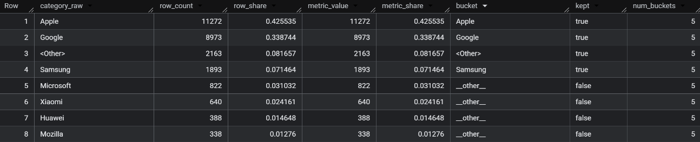

## dbt-buckets – Bucketing Categories in SQL

### Why this project exists

Analysts and engineers often need to collapse long categorical tails into a
handful of buckets so models stay robust and interpretable. Typical solutions
involve bespoke queries or exporting the data elsewhere, which fragments
the workflow outside your warehouse. **dbt-buckets** keeps the entire
categorisation process in SQL: reuse the same macros across projects, stay
deterministic, and keep outputs tightly integrated with your dbt models.

The macros in this project generate bucket mappings that you can apply to any
relation. They are written for BigQuery today, but the public interface is kept
generic so other adapters can be added later.

#### Installation

Add this package to your `packages.yml` (or to the `packages` section of
`dbt_project.yml`) and pull dependencies with `dbt deps`:

```yaml
packages:
  - package: datooine/dbt-buckets
    version: "~> 0.1"
```

```bash
dbt deps
```

Once installed, call the macros through the `dbt_buckets` namespace:

```jinja
{{ dbt_buckets.bucket_map(
    relation=ref('my_events'),
    category_expr='COALESCE(channel, "Unknown")',
    policy='pareto',
    coverage=0.8,
    min_categories=5
) }}
```

#### Supported policies

- **Pareto (`policy='pareto'`)** – keeps the smallest set of categories needed
  to cover a desired share of the metric (`coverage`, default 80%). Think “top
  X% plus other”. A `min_categories` backstop
  ensures you always expose a minimum width even if the coverage is achieved
  quickly.
- **Top-K (`policy='top_k'`)** – keeps exactly `k` categories (ties resolved via
  `tiebreaker`) and sends the rest to `other`. Ideal when you already know how
  many buckets you want or need consistency across segments.
- **Minimum threshold (`policy='min_threshold'`)** – keeps any category whose
  metric share is above `min_share`. Everything else falls into `other`, with an
  optional `min_categories` safety net. Use this when you care about absolute
  visibility (e.g., “show anything above 2%”).

All policies honour `pins`, letting you force important categories to stay even
if they would otherwise fall into the pooled bucket. The output arranges the
categories by metric share (or custom metric), making the behavior predictable
across runs.

#### Configurable ranking metrics

By default the macros rank categories by volume (row count). Pass
`rank_by_metric` to use any aggregation your warehouse supports: revenue sums,
`COUNT(DISTINCT user_pseudo_id)`, conversion rate composites, etc. The chosen
metric drives ordering, share calculations, and the policy decisions, while row
count metadata is still retained for reference.

---

### Public macros

#### `bucket_map`
Builds a mapping table with one row per raw category. Each row contains the
bucket assignment plus helpful metadata (shares, cumulative metrics, number of
buckets, etc.).

Parameters:

| name | type | default | description |
| ---- | ---- | ------- | ----------- |
| `relation` | relation/sql | required | Source relation or CTE to analyse. |
| `category_expr` | sql | required | Expression that yields the raw category. |
| `policy` | string | `'pareto'` | One of `pareto`, `top_k`, `min_threshold`. |
| `coverage` | float | `0.80` | Pareto coverage threshold when `policy='pareto'`. |
| `k` | integer | `None` | Number of categories to keep when `policy='top_k'`. |
| `min_share` | float | `0.05` | Minimum share threshold when `policy='min_threshold'`. |
| `pins` | array<string> | `[]` | Categories to keep regardless of policy. |
| `min_categories` | integer | `3` | Minimum visible buckets (kept + OTHER). |
| `other_label` | string | `'__other__'` | Label for the pooled category. |
| `tiebreaker` | string | `'alpha'` | Tie resolution (`alpha` or `version`). |
| `rank_by_metric` | sql | `None` | Custom aggregation such as `COUNT(DISTINCT user_id)`. |
| `indent` | integer | `0` | Indent the rendered SQL when embedding in larger queries. |

Example:

```jinja
with mobile_brand_map as (
  {{ dbt_buckets.bucket_map(
      relation='`bigquery-public-data.ga4_obfuscated_sample_ecommerce.events_20210131`',
      category_expr='COALESCE(device.mobile_brand_name, "Unknown")',
      policy='pareto',
      coverage=0.8,
      min_categories=5
  ) }}
)
select *
from mobile_brand_map
order by category_rank;
```



This is the same query shipped in `analyses/bucket_map_pareto_mobile_brand.sql`,
making it easy to visualise or screenshot the output as a demo.

#### `apply_bucket_map`
Joins a previously generated bucket map back onto a relation so every row
receives its bucket label.

Parameters:

| name | type | default | description |
| ---- | ---- | ------- | ----------- |
| `relation` | relation/sql | required | Relation/CTE containing the raw data. |
| `category_expr` | sql | required | Expression used to join to the map. |
| `bucket_map_relation` | relation/sql | required | Mapping built by `bucket_map`. |
| `bucket_field` | string | `'bucket'` | Column from the map to use as label. |
| `category_key` | string | `'category_raw'` | Column in the map that stores the raw category. |
| `passthrough_columns` | array<string> | `[]` | Additional map columns to project (e.g. `kept`, `pinned`). |
| `other_label` | string | `'__other__'` | Fallback label when a category is missing. |
| `indent` | integer | `0` | Optional indentation for the rendered SQL. |

Example:

```jinja
with mobile_brand_map as (
  {{ dbt_buckets.bucket_map(
      relation='`bigquery-public-data.ga4_obfuscated_sample_ecommerce.events_20210131`',
      category_expr='COALESCE(device.mobile_brand_name, "Unknown")',
      policy='pareto',
      coverage=0.8,
      min_categories=5
  ) }}
)
select
  labeled.user_pseudo_id,
  labeled.bucket as mobile_brand_bucket
from (
  {{ dbt_buckets.apply_bucket_map(
      relation='`bigquery-public-data.ga4_obfuscated_sample_ecommerce.events_20210131`',
      category_expr='COALESCE(device.mobile_brand_name, "Unknown")',
      bucket_map_relation=mobile_brand_map
  ) }}
) as labeled;
```

Both macros return raw SQL strings, so you can materialise them as ephemeral
models, run them inside analyses, or embed them in downstream models.

---

### Example analyses

The repository includes a few one-off analyses that showcase common policies on
BigQuery’s GA4 public dataset (`bigquery-public-data.ga4_obfuscated_sample_ecommerce.events_20210131`).

* `analyses/bucket_map_pareto_mobile_brand.sql` – Pareto coverage on
  `device.mobile_brand_name` keeping at least five buckets.
* `analyses/bucket_map_topk_medium.sql` – Top‑K traffic source mediums ranked by
  `COUNT(DISTINCT user_pseudo_id)`.
* `analyses/bucket_map_min_threshold_country.sql` – Minimum share of 2% on
  `geo.country` with a width backstop.
* `analyses/apply_bucket_map_demo.sql` – Stepwise example that applies three
  mappings back onto the events table to produce per-user bucket labels.

Run any analysis with:

```bash
dbt compile --select analyses/<file>.sql
``` 

or open the compiled SQL in `target/compiled/analyses/` after compilation. Each
file demonstrates how to pass parameters to the macros and how the resulting
mapping behaves.

---

### Contributing & local development

```bash
uv sync --extra dev   # install dbt + adapters
uv run dbt compile    # smoke test the macros
uv run ./scripts/run_unit_tests.sh
```

The unit tests exercise the macros using dbt-unit fixtures. The GitHub Actions
workflow runs the same compile/tests for every PR and publishes the generated
docs to GitHub Pages when changes land on `main`.

Feel free to open an issue or PR if you want to add another adapter, policy, or
consumption pattern.
